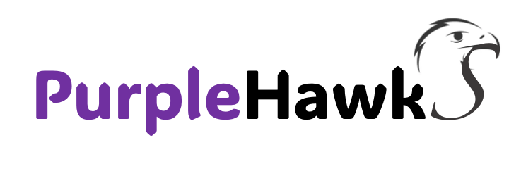

# PurpleHawkS is a ALL-IN-ONE Virtual Machine with open source tools used for Purple Teaming
## This is design to provide knowledge and learning on various tools that can be used as part of purple teaming execrises
### Cybersecurity areas focused on:
* Mitre ATT&CK-D3FEND Framework
* Purple teaming
* Adversary Emulation
* Detection Engineering
* Threat Hunting
* Endpoint Detection and Response
* Security Information and Event Management

Please follow to learn more: https://medium.com/@chandrak.trivedi/list/purplehawks-946e0323c4d7 
